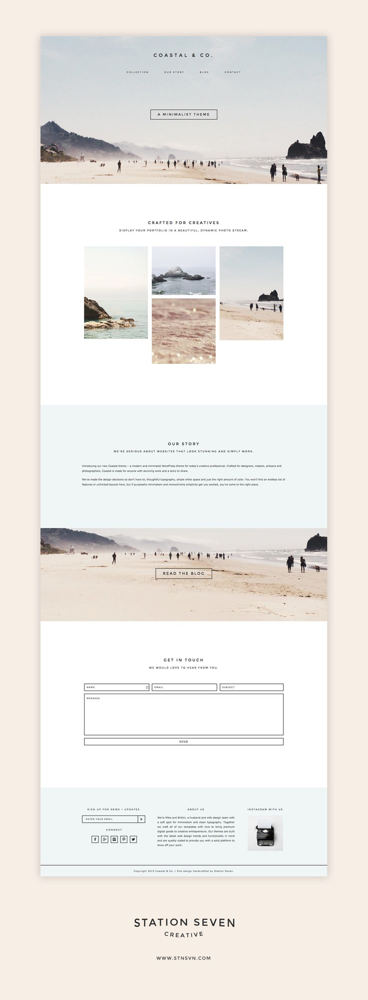

# Lab

## Create This Mockup
1. 
1. You do not have to use the exact photography in this mockup.  Feel free to find your own
1. Do not worry about matching the fonts
1. For the "GET IN TOUCH" section, do not worry about creating form elements for name, email, subject, message, send.  Just use standard elements that we've learned about (maybe divs?) and style them appropriately.
1. You won't get it all done.  See how far you can get.

## Stretch:

1. Research form elements and add them in to match the mockup
1. Research fonts and find something that matches closely to the mockup
1. Finish the entire mockup!
